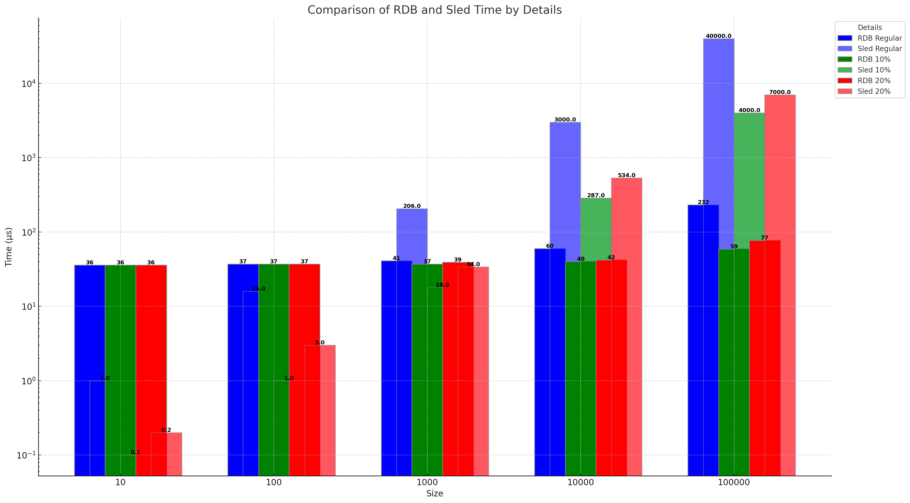

# Readatabase (readb)


A wise man once said: "Don't reinvent the wheel". Yet, here we are, a new simple embedded key-value database. 

readb is written in pure rust and is designed to be as simple as sled, while focusing strictly on read performance. The
database can be seen primarily as a read-only database, although it does support writes (and deletes). The database is
designed around the fundamental assumption that 99 % of operations are reads, more about this later.

## Features
- **Custom cache options**: You can choose between different caching strategies and cache sizes, although most of them are
  still in development.
- **Lock free reads**: Reads are lock free and hence can be performed concurrently.
- **Remote cloning**: Clone the database from a remote address to a local path

## Why is readb so fast?
readb was designed read-first. This means that we can assume that our data content is static and will not change. This
allow us to keep the data on the disk, but the index in memory. This allows us to have a very small memory footprint,
while still being able to read data very fast.

Not static, doesn't mean that you cannot add new keys. There are 2 options for adding new keys:
- **link**: Link a key to another key, does not copy the data
- **put**: Insert a new key-value pair into the database, appends the data to the end of the file

This append-only approach is a major reason for the speed of readb, whereas most other databases will use a B-tree or
similar data structure to store the data, readb will simply append the data to the end of the file. 

## Twist?
When you look at the benchmarks later, you will notice that readb is beating both sled and redb for larger data-sizes. This
is because we don't benchmark deletes. readb was never designed around deletes, and hence unused data is never deleted.
We have introduced the garbage collection feature which can be called to index the database again and remove unused data,
however, this is not recommended in a running system, but rather on startup or during no-activity periods.

## Benchmarks

There are 2 benchmarks performed, a read only benchmark, and a read-write benchmark with 99 percent reads. First the write
benchmark:

| Operations | `readb` mean time | `sled` mean time |
|------------|-------------------|------------------|
| 1,000      | 147.02 µs         | 332.65 µs        |
| 10,000     | 10.517 ms         | 3.7671 ms        |
| 100,000    | 108.45 ms         | 40.801 ms        |
| 1,000,000  | 238.48 ms         | 485.63 ms        |

While readb is faster, please note that it does not compress the data.

Here for the read benchmarks:
- retrieve x items: retrieve all items from the database in random order
- retrieve x items (10 percent): retrieve 10 percent of the items from the database in random order
- retrieve x items (20 percent with repetitions): retrieve 3.5 percent of the items, but the total count is 20 percent of the items, so there are repetitions

all times are in µs:

| Benchmark type                                           | time rdb   | time sled  | time redb  |
|----------------------------------------------------------|------------|------------|------------|
| Retrieve 1000 items                                      | 50.30      | 79.25      | 97.95      |
| Retrieve 1000 items (10 percent)                         | 49.05      | 17.84      | 22.39      |
| Retrieve 1000 items (20 percent with repetitions)        | 49.16      | 33.92      | 43.17      |
| Retrieve 10000 items                                     | 67.56      | 1,256.75   | 1,225.68   |
| Retrieve 10000 items (10 percent)                        | 55.29      | 311.57     | 357.98     |
| Retrieve 10000 items (20 percent with repetitions)       | 61.13      | 541.79     | 692.16     |
| Retrieve 100000 items                                    | 209.59     | 36,977     | 52,558     |
| Retrieve 100000 items (10 percent)                       | 86.25      | 3,465.1    | 5,090.9    |
| Retrieve 100000 items (20 percent with repetitions)      | 124.29     | 6,831.8    | 10,151     |


To show the difference in performance look at the following graph:



readb is the non-existant blue line, it is so fast that in comparison to sled and redb it is not even visible.

## Usage

### Setting up the Database

The `Database` struct is the core representation of the database, managing indexing, caching, and data loading. It requires two generic parameters:

- `C`: This represents the caching mechanism. Any type that implements the `Cache` trait can be used.
- `L`: This represents the data loading mechanism. Any type that implements the `Loader` trait can be used.

#### Database Initialization:

1. **Using Custom Settings**

   You can provide custom settings using the `DatabaseSettings` structure:

   ```rust
   let db_settings = DatabaseSettings {
       path: Some(PathBuf::from("/path/to/db/directory")),
       cache_size: Some(1024),
       index_type: IndexType::HashMap,
   };
   let db: Database<YourCacheType, LazyLoader> = Database::new(db_settings).unwrap();
   ```

2. **Using Default Settings**

   If you want to initialize the database with default settings, only providing the directory:

   ```rust
   let db = Database::<YourCacheType, LazyLoader>::new_default(PathBuf::from("/path/to/db/directory"));
   ```

3. **Using the Default Database Type**

   For convenience, a `DefaultDatabase` type is provided, which uses `LfuCache` for caching and `LazyLoader` for loading:

   ```rust
   let default_db = DefaultDatabase::new_default(PathBuf::from("/path/to/db/directory"));
   ```

### Working with the Database

1. **Getting a Value**

   To retrieve a value associated with a given key:

   ```rust
   let value: Option<Vec<u8>> = db.get("your_key").unwrap();
   ```

2. **Linking Keys**

   If you wish to create an alias for an existing key:

   ```rust
   db.link("existing_key", "new_alias_key").unwrap();
   ```

3. **Deleting a Key**

   This will delete the key from the index table, but not from the disk:

   ```rust
   db.delete("key_to_remove").unwrap();
   ```

4. **Persisting Data**

   To ensure data persistence:

   ```rust
   db.persist().unwrap();
   ```

### Additional Features

1. **Writing Data** (requires `write` feature)

   To add a new key-value pair:

   ```rust
   db.put("new_key", b"your_value").unwrap();
   ```

2. **Garbage Collection** (requires `garbage-collection` feature)

   To perform garbage collection:

   ```rust
   db.gc().unwrap();
   ```

## Roadmap to 1.0

Before we can release 1.0, we need to implement more caching strategies. The API however is stable and will not change
before 1.0, we're already using it in production.

## License

This project is licensed under Apache License, Version 2.0 (http://www.apache.org/licenses/LICENSE-2.0).
