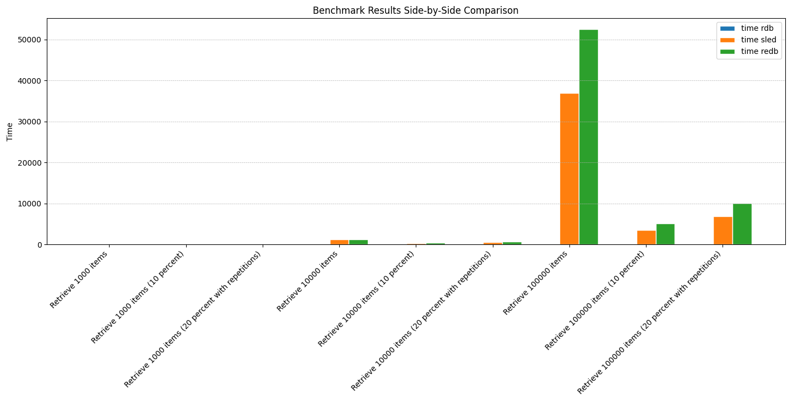

# Readatabase (readb)

A simple, embedded read only key-value database implemented in Rust. The database strict focus on performance makes it
infinitely faster than sled (see the benchmark section below). 

## Why a read only database?

More often than not, we need a database to act as a LUT (Look Up Table) for static data. We will pre-populate the database
on startup and then use it for reads. In such a scenario, we do not need a database that supports writes. In fact, we can
populate the database before starting the app and then use it as a read only database.

At Basis Health, we use this database for exercise data. We can quickly query thousands of exercises without freezing the
app, or being dependent on the file system.

## Features
- **Fast and Efficient**: Uses caching to speed up frequently accessed reads.
- **Modular Design**: Switch between different indexing strategies and caching methods easily.
- **Lock free reads**: Reads are lock free and hence can be performed concurrently.

## Limitations
- **Read Only**: The database is read only and hence cannot be used for writes.
- **One time indexing**: The database is indexed only once at the start and hence cannot be used for dynamic data.

## Functionality
### Base API
- **new**: Create a new database.
- **get**: Get the value associated with a key.
- **link**: Link a key to another key
- **delete**: Delete a key, does not delete any links or actual data
- **persist**: Persist the new links to the database

### index-write feature

- **new_index_table**: Create a new index table
  - get: Get the value associated with a key.
  - insert: Insert a new key-value pair into the index table
  - load: Load the index table from the path
  - persist: Persist the index table to the path

### remote-cloning feature
- **clone_from(address, path, compression)**
  - Clone the database from a remote address to a local path
  - compression: Compression type to use for the transfer. If None, no compression is used


## Getting Started

### Prerequisites

Make sure you have Rust and Cargo installed. If not, [install them from the official website](https://rustup.rs/).

### Installing

Clone the repository:

```bash
git clone https://github.com/Basis-Health/readb.git
cd readb
```

Then build the project:

```bash
cargo build --release
```

### Usage

To use the database in your Rust project, add it as a dependency in your `Cargo.toml`:

```toml
[dependencies]
readb = { path = "path-to-your-local-repo" }
```

Then, use the provided API to interact with the database:

```rust
use readb::{Database, DatabaseSettings, IndexType};

let mut db = DefaultDatabase::new(DatabaseSettings {
    path: Some(PathBuf::from(database_dir)),
    cache_size: None, // Cache Default
    index_type: IndexType::HashMap,
}).unwrap();


let existent_value = db.get("hi").unwrap();
assert_eq!(existent_value.unwrap(), "hello".to_string());

let non_existent_value = db.get("non-existent").unwrap();
assert!(non_existent_value.is_none());
```

DefaultDatabase is a HashMap based indexing strategy and a LFU based caching strategy

The database directory has to be a directory that exists and is writable. Alternatively, you cau use the `ignore-path-check`
feature to ignore the path check and create the database in a file. However, that feature is not tested and is not recommended.

## Benchmarks
There are three benchmarks:
- Regular: Access each key once
- 10%: Access 10% of the keys
- 20%: Access 3.5% of the keys 0.2n times

| Size       | readb time | sled time   | redb time | Details |
|------------|------------|-------------|-----------|---------|
| 10         | 36 µs      | 1 µs        | 910 ns    | Regular |
| 10         | 36 µs      | 115 ns      | 350 ns    | 10%     |
| 10         | 36 µs      | 220 ns      | 410 ns    | 20%     |
| ---------- | ---------- | ----------- | --------- | ------- |
| 100        | 37 µs      | 16 µs       | 12 µs     | Regular |
| 100        | 37 µs      | 1  µs       | 1 µs      | 10%     |
| 100        | 37 µs      | 3  µs       | 2 µs      | 20%     |
| ---------- | ---------- | ----------- | --------- | ------- |
| 1000       | 41 µs      | 206 µs      | 234 µs    | Regular |
| 1000       | 37 µs      | 18 µs       | 22 µs     | 10%     |
| 1000       | 39 µs      | 34 µs       | 43 µs     | 20%     |
| ---------- | ---------- | ----------- | --------- | ------- |
| 10000      | 60 µs      | 3 ms        | 3.6 ms    | Regular |
| 10000      | 40 µs      | 287 µs      | 352 µs    | 10%     |
| 10000      | 42 µs      | 534 µs      | 691 µs    | 20%     |
| ---------- | ---------- | ----------- | --------- | ------- |
| 100000     | 232 µs     | 40 ms       | 52 ms     | Regular |
| 100000     | 59 µs      | 4 ms        | 5 ms      | 10%     |
| 100000     | 77 µs      | 7 ms        | 10 ms     | 20%     |



readb performs significantly better than sled and redb when the data size is large enough. Because of rdb's unique index design,
the performance improvement grows as the data size increases.

## Roadmap

- [x] Implement a basic database
- [x] Implement a basic indexing strategy
- [x] Implement a basic caching strategy
- [x] Implement a basic API
- [x] Implement remote cloning
- [x] Implement compression
- [x] Implement a benchmarking suite
- [ ] Implement more indexing strategies
  - [x] HashMap
  - [x] BTreeMap
  - [ ] LSM Tree
  - [ ] B+ Tree
- [ ] Implement a more efficient caching strategy
  - [x] LFU
  - [ ] LRU
  - [ ] ARC
  - [ ] MRU
- [x] Add delete on keys

## Future Work

This project is intended as the groundwork for a key-value database with write support.